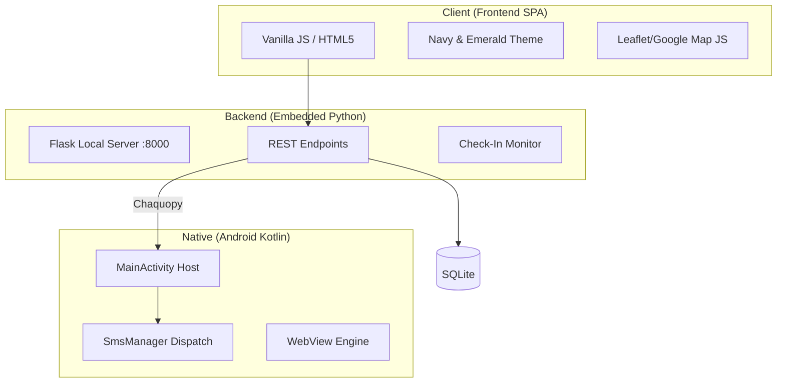

# ResQ — Citizen Safety & Emergency Management Platform

ResQ is a professional-grade safety application designed to empower citizens with real-time emergency tools, community-driven incident reporting, and reliable SOS dispatch. Built with a unique **Embedded Hybrid Architecture**, it combines the power of a Python/Flask backend with the portability of a native Android wrapper.


---

## 🌟 Key Features

### 🚨 Robust SOS Dispatch
*   **Direct SMS Integration:** Unlike standard web-apps, ResQ uses the device's physical SIM card to send real-time SMS alerts to emergency contacts.
*   **Live Location Sharing:** Every SOS message includes a precise Google Maps link to the user's coordinates.
*   **Offline Tracking:** Dispatched via native Android `SmsManager` with status confirmation.

### 🛡️ Safe Route Planner
*   **Intelligence Scoring:** Analyzes recent community-reported incidents along your path to generate a 0-100 Safety Score.
*   **Map Selection:** Tap anywhere on the map to set your start and destination points.
*   **Real-time Feedback:** Recommends alternative paths if high-severity incidents (theft, harassment, etc.) are detected nearby.

### 📍 Community Incident Reporting
*   **Verified Hotspots:** Users can report accidents, fire, medical emergencies, or infrastructure issues.
*   **Photo Evidence:** Support for uploading photo proof to alerts.
*   **Anonymous Mode:** Report dangerous situations while protecting your identity.

### 🔍 Missing Persons Network
*   **Active Alerts:** Community-wide alerts for missing individuals with last-seen locations.
*   **Found Tracking:** Real-time updates when a person is safely located.

### 🏥 Offline First Aid Guide
*   **Step-by-Step Instructions:** Complete guide for CPR, choking, bleeding, and snakebites.
*   **Visual Aids:** SVG-based iconography for quick understanding in high-stress situations.

---

## 🏗️ System Architecture

ResQ follows an **Embedded Hybrid Pattern**, hosting a full server stack locally on the mobile device for maximum privacy and reliability.



---

## 🚀 Setup & Installation

### Android (Mobile App)
1.  **Clone the Repo:**
    ```bash
    git clone https://github.com/sohampatil01-svg/ResQ.git
    ```
2.  **Open in Android Studio:**
    *   Wait for Gradle to sync.
    *   If prompted for a Python environment, Chaquopy will automatically handle the 3.10 installation.
3.  **Build & Run:**
    *   Connect a **Physical Android Device** (Required for SMS functionality).
    *   Grant **Location** and **SMS** permissions on the first launch.

### Local Development (Python/Browser)
If you wish to test the backend logic on your PC:
1.  Install dependencies:
    ```bash
    pip install flask werkzeug
    ```
2.  Run the server:
    ```bash
    python ResQ_server.py
    ```
3.  Open `http://localhost:8000` in your browser.

---

## 🛠️ Tech Stack
*   **Frontend:** Vanilla JavaScript (ES6+), HTML5, CSS3 (Custom Variables).
*   **Backend:** Python 3.10, Flask (Lightweight API).
*   **Android:** Kotlin, Chaquopy (Python Bridge), SmsManager API.
*   **Database:** SQLite 3 (Write-Ahead Logging enabled).
*   **Mapping:** Leaflet.js / Google Maps JS API.

---

## 🛡️ Safety Warning
*ResQ is a supplementary safety tool. In life-threatening situations, always contact national emergency services (112 / 100) immediately using the native dialer buttons provided in the app.*

---
**Developed with focus on Citizen Safety & Rapid Emergency Response.**
